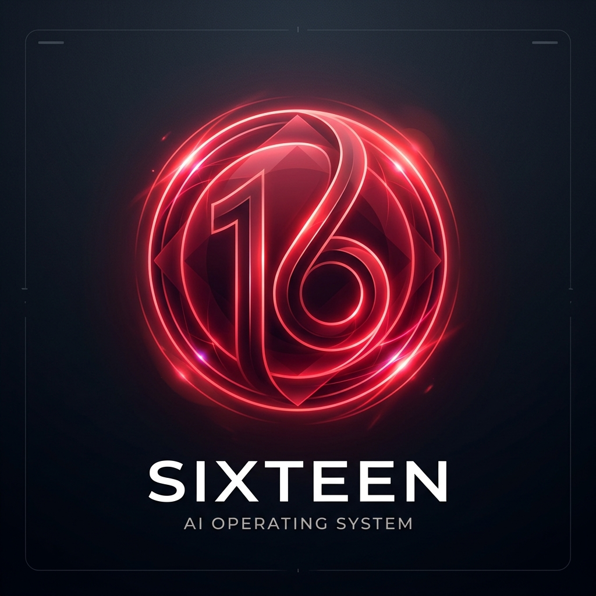

  
  <h1>Sixteen</h1>
  
<strong>The Premium Agentic AI Operating System</strong>

  

    <a href="#overview">Overview</a> •
    <a href="#features">Features</a> •
    <a href="#capabilities">Capabilities</a> •
    <a href="#tech-stack">Tech Stack</a> •
    <a href="#installation">Installation</a>
  

---

## Overview

**Sixteen** is not just an assistant—it is a deeply integrated, highly autonomous **Agentic Operating System** designed for modern workflows. Operating primarily through a visually unobtrusive, always-on-top transparent UI (the "Orb" and the "AI Cursor"), Sixteen serves as a bridge between human intent and computer execution.

Combining real-time screen vision, advanced UI accessibility hooks, and an autonomous "Action-Observation" loop, Sixteen is capable of fully taking over the system to execute complex browser-based or system-level tasks.

---

## Features

- **The Orb Interface:** A sleek, transparent, always-on-top React/Tauri component that visually indicates the AI's current state (IDLE, LISTENING, THINKING, SPEAKING).
- **Agentic Computer Use & AI Cursor:** An overlay cursor controlled by Sixteen that mimics human movements and performs high-level automation, giving you visual feedback of the AI's actions.
- **Contextual Pointing (Hybrid Approach):** Simply point at an element on your screen and tell Sixteen, *"Type XYZ in here."* Using the Windows UIAutomation API combined with Groq Vision fallback, Sixteen instantly understands your pointer's context.
- **Action-Observation Loop:** Give Sixteen a high-level goal (e.g., *"Book a flight to NYC"*). It will recursively analyze the browser screen, determine the next steps, and execute UI events (clicks, typing, navigation) completely autonomously.
- **Always-on Wake Word:** Continuous local background listening with ultra-low latency, instantly activating the system when it hears *"Hey, Sixteen"*.
- **Physical Interruptibility:** When Sixteen is autonomously controlling the mouse, simply moving your physical mouse will interrupt and cancel the AI's current task, instantly returning control to you.

---

## Capabilities

| Capability | Description |
| :--- | :--- |
| **System Navigation** | Launch applications, manage files, and execute terminal commands. |
| **Web Navigation** | Open URLs, perform Google searches, or play specific YouTube videos autonomously. |
| **Autonomous Booking** | Navigate flight, hotel, or booking websites with the Action-Observation loop. |
| **Visual Analysis** | Take screenshots and ask deep questions about what is currently visible on the screen. |
| **Memory** | Remember important facts across sessions through the integrated SQLite database. |
| **Agent Handoff** | Delegate complex coding tasks to the integrated `Antigravity` CLI tools. |

---

## Tech Stack

### Frontend / UI
- **Framework:** React 18 & TypeScript
- **Desktop Runtime:** Tauri v2
- **Build Tool:** Vite
- **Styling:** CSS-in-JS & Vanilla CSS with modern animations

### Backend / Core
- **Server:** FastAPI (Python 3.11)
- **AI Core:** Groq API (Llama-3-70B & LLaVA Vision models)
- **Database:** SQLite & aiosqlite
- **Event Bus:** Asynchronous WebSockets (`websockets`)

### Agentic Capabilities
- **Screen Capture:** MSS & Pillow (with aggressive caching/compression)
- **Computer Vision:** Groq Vision models for screenshot-to-action inference
- **UI Automation:** Windows `uiautomation`, `pyautogui`, & `pynput`
- **Browser Control:** Playwright & `CloakBrowser` framework for isolated execution

### Voice Pipeline
- **Speech-to-Text:** Faster-Whisper
- **Text-to-Speech:** Kokoro-ONNX
- **Wake Word Detection:** OpenWakeWord & Web Speech API

---

  Built for the future of Human-Computer Interaction.

