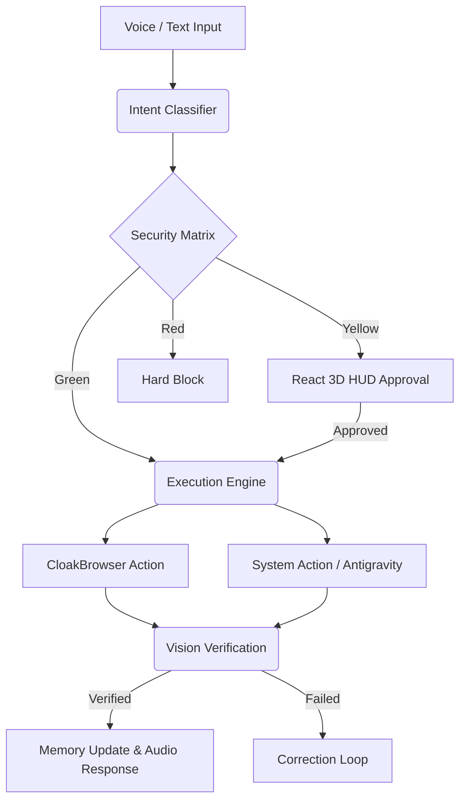

<div align="center">
  <h1>Sixteen OS</h1>
  <p><b>The High-Performance Agentic Operating System for Windows</b></p>
  
  [](https://opensource.org/licenses/MIT)
  [](https://www.python.org/downloads/)
  [](https://fastapi.tiangolo.com)
  [](https://docs.pmnd.rs/react-three-fiber/getting-started/introduction)
</div>

---

## ⚡ The Next Evolution of Personal Computing

**Sixteen** is not just another chatbot or wrapper. It is a deeply integrated, highly specialized AI operating system designed for execution, autonomy, and security. Built with a robust backend architecture, Sixteen acts as a world-class digital chief of staff—capable of interacting with your file system, web browsers, and terminal with the same dexterity as a human engineer.

> [!NOTE]  
> Sixteen is designed exclusively for high-end automation, research, and technical delegation, completely redefining what a personal assistant can do.

---

## 🧠 Core Features & Capabilities

### 1. Vision & Verification Engine
Sixteen doesn't just guess what happens after clicking a button—it **sees** it.
* **Intent → Plan → Execute → Verify:** A closed-loop execution pipeline.
* **Automated Screenshots:** Utilizes MSS to silently capture the screen post-execution.
* **LLM Verification:** Passes the active screen state to advanced Vision Models (Groq) to ensure an action achieved the desired UI state before proceeding.

### 2. Stealth Web Automation
* **CloakBrowser Integration:** Powered by stealth-patched Chromium to bypass anti-bot detections.
* **Humanized Interactions:** Avoids rigid element scraping by analyzing the DOM and performing human-like cursor movements and clicks.
* **Native YouTube & Media Handling:** Tell Sixteen to search for a video, and it will spawn a headed, persistent browser session to play media natively.

### 3. Dynamic State Modes
Sixteen adapts its cognitive processing and tool availability based on the task:
* **Normal Mode:** Conversational, helpful, and concise.
* **Engineering Mode:** Deep technical analysis, architecture design, and strict terminal/system commands.
* **Research Mode:** Aggressive web scraping, cross-referencing, and factual synthesis with cited sources.
* **Creator Mode:** Expanded context window for creative writing, asset generation, and brainstorming.

### 4. Advanced Security Matrix
With deep system access comes deep responsibility. Sixteen classifies all intents into a rigid, 3-tier Security Zone system:
* 🟢 **Green Zone:** Safe operations (read files, browse web, view clipboard). Executed instantly.
* 🟡 **Yellow Zone:** High-risk operations (write files, modify data). Intercepted instantly. The React UI spawns an overlay requiring explicit **Approve/Deny** confirmation before proceeding.
* 🔴 **Red Zone:** Destructive operations (format drives, system32 access). Hard-blocked at the kernel level.

### 5. Antigravity Delegation
Why do it yourself when you can delegate?
* **Subagent Invocation:** Sixteen acts as the orchestrator, seamlessly handing off heavy, multi-step engineering tasks to specialized Antigravity CLI agents in detached processes.

---

## 🛠️ System Architecture



---

## 📦 Tech Stack

| Category | Technologies | Purpose |
|----------|-------------|---------|
| **Backend Core** | FastAPI, Uvicorn, Python 3.11 | High-performance async processing engine. |
| **Frontend UI** | React, Three.js (R3F), Tauri | Lightweight, hardware-accelerated 3D holographic interface. |
| **AI / Brain** | Groq (LLaMA 3.2 Vision) | Ultra-low latency inference and visual verification. |
| **Browser Engine**| CloakBrowser, Playwright | Undetectable, humanized web automation. |
| **Voice Stack** | faster-whisper, kokoro-onnx, openwakeword | Local, offline wake-word detection, STT, and TTS. |
| **System Tools** | MSS, PyAutoGUI, aiosqlite | Screen capture, OS-level macro control, and fast persistent memory. |

---

## 🚀 Quick Start Guide

### Prerequisites

| Requirement | Description | Link |
|-------------|-------------|------|
| **Python 3.11+** | Required for backend services. | [Download](https://www.python.org/) |
| **Node.js 18+** | Required for the React/Tauri HUD. | [Download](https://nodejs.org/) |
| **Groq API Key** | Ultra-fast inference engine access. | [Get Key](https://console.groq.com/) |

### Local Setup

```bash
# 1. Clone the repository
git clone https://github.com/YourUsername/SixteenOS.git
cd SixteenOS

# 2. Configure Environment
cp julie/.env.example julie/.env
# Add your GEMINI_API_KEY and GROQ_API_KEY to the .env file

# 3. Start the entire system via batch script
.\start-tunnel.bat
```

> [!IMPORTANT]  
> Ensure your microphone is correctly configured in your OS settings, as Sixteen relies on continuous background listening for the "Hey Sixteen" wake word.

---

## 🛡️ Contributing & Security

> [!CAUTION]  
> **Never commit your `.env` file or API keys!** Sixteen possesses full filesystem and terminal access. Do not expose your instance publicly without rigorous authentication middleware.

If you'd like to contribute to the core orchestration engine or add new CLI tools:
1. Fork the Project
2. Create your Feature Branch (`git checkout -b feature/AmazingFeature`)
3. Commit your Changes (`git commit -m 'Add some AmazingFeature'`)
4. Push to the Branch (`git push origin feature/AmazingFeature`)
5. Open a Pull Request

---

<div align="center">
  <p><i>"The future of computing isn't typing; it's delegating."</i></p>
</div>
